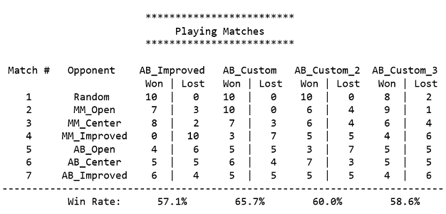
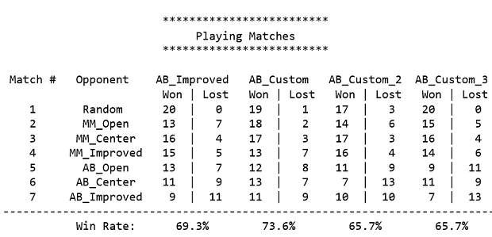
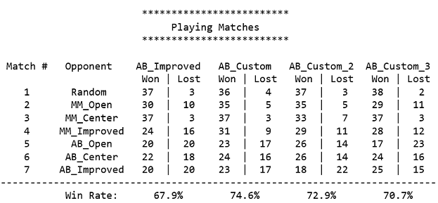

# Introduction
In this repo I discuss my implementation for developing an adversarial search agent to play the game "Isolation".   Completion of this  [project](https://github.com/udacity/AIND-Isolation) was a requirement for Udacity’s program [Artificial Intelligence Nanodegree (AIND) and Specializations.](https://confirm.udacity.com/GGGH2GSK)
>


# Adversarial Search Agent Project Instructions 
Build an adversarial search agent to play the game "Isolation" by implementing three search algorithms and three custom heuristic functions:

> Search functions:
```
1.	MinimaxPlayer.minimax(): implement minimax search
2.	AlphaBetaPlayer.alphabeta(): implement minimax search with alpha-beta pruning
3.	AlphaBetaPlayer.get_move(): implement iterative deepening search
```
> Search functions key definition:
> * __Minimax algorithm__ - The minimax algorithm is an adversarial search strategy to determine the optimal value from a game tree.  The algorithm calculates the minimax decision of the current state, using a recursive computation method. The minimax value of a node is the utility of being in the corresponding state, assuming that both players play optimally from there to the end of the game. The recursion proceeds all the way to bottom of the decision tree and the miminax values are backed up through the tree as the recursion unwinds.
> 
> * __Minimax algorithm with alpha-beta pruning__ - The minimax algorithm with alpha-beta pruning allows us to ignore portions of the search tree that make no difference to the final choice without doing a complete search.  With alpha-beta pruning we get the same outcome if we had done a full search. 
>
> * __Iterative deepening__ - Iterative deepening is a search strategy, often used in combination with depth-first tree search, that finds the best depth limit. It gradually increases the search depth limit until a goal is found or until we reach the max depth limit. Iterative deepening combines the benefits of depth-first and breadth-first search.  Iterative deepening is a desirable search strategy when the search space is large and the depth of the solution is not known. 

> Evaluation heuristics functions:
```
1.	custom_score(): implement 1st best position evaluation heuristic
2.	custom_score_2(): implement 2nd alternate position evaluation heuristic
3.	custom_score_3(): implement 3rd alternate position evaluation heuristic
```

After implementing the three search and three evaluation heuristics functions we then need to run a tournament.   The tournament will evaluate the performance of each of the three custom heuristic against seven pre-defined agents which are described below:   
1.	Random: An agent that randomly chooses a move on each turn.
2.	MM_Open: MinimaxPlayer agent using the open_move_score heuristic with search depth 3
3.	MM_Center: MinimaxPlayer agent using the center_score heuristic with search depth 3
4.	MM_Improved: MinimaxPlayer agent using the improved_score heuristic with search depth 3
5.	AB_Open: AlphaBetaPlayer using iterative deepening alpha-beta search and the open_move_score heuristic
6.	AB_Center: AlphaBetaPlayer using iterative deepening alpha-beta search and the center_score heuristic
7.	AB_Improved: AlphaBetaPlayer using iterative deepening alpha-beta search and the improved_score heuristic

We also need to provide a brief discussion for each of the three heuristics function describing the reasoning for choosing that particular implementation.

After running a tournament we need to provide an analysis of the results, describing the performance of the agent using the different heuristic functions.  

Another requirement for this assignment is to write a short research paper in the field of Game-Playing.  My research paper can be found in the [`research_review.md`](research_review.md) file.

# Isolation as Described by the Project Instructions 
Isolation is a deterministic, two-player game of perfect information in which the players alternate turns moving a single piece from one cell to another on a board. Whenever either player occupies a cell, that cell becomes blocked for the remainder of the game. The first player with no remaining legal moves loses, and the opponent is declared the winner. These rules are implemented in the isolation.Board class provided in the repository.

This project uses a version of Isolation where each agent is restricted to L-shaped movements (like a knight in chess) on a rectangular grid (like a chess or checkerboard). The agents can move to any open cell on the board that is 2-rows and 1-column or 2-columns and 1-row away from their current position on the board. Movements are blocked at the edges of the board (the board does not wrap around), however, the player can "jump" blocked or occupied spaces (just like a knight in chess).

# What is Adversarial Search?
Adversarial search problems are competitive problems where AI agents' goals are in conflict. Adversarial search problems are often referred to as games.  The game of isolation in particular is a deterministic, turn-taking, two-player, zero-sum adversarial search problem of perfect information.  In isolation two agents act alternately and the utility values at the end of the game are always zero (one player wins and the other loses).

# Hueristic Functions Discussion
My heuristic functions score a game state by counting the possible future moves from the current legal moves.  My three heuristic functions vary on how they handle possible future moves but essentially each score function is trying to a give a score based on one or two moves ahead of the current game state.    

For example, if the given player has possible legal moves of (2, 2) and (1, 0) we then count the legal moves from (2, 2) and (1, 0) to get NEW LEGAL MOVES (one move ahead). We can then further count the possible legal moves from the NEW LEGAL MOVES (one move ahead) to get NEW LEGAL MOVES (two moves ahead). 

> ### Hueristic Functions Summary:
>
> **custom_score():**
> This function counts the number of possible future moves (from the current legal moves) one move ahead for the given player and then performs the same count, but for the opposing player, and returns the net difference (given player - opposing player). This approach is akin to the improve_score () function. 
>
>   **custom_score_2():**
>  This function counts the number of possible futures moves (from the current legal moves) one move and two moves ahead for the given player and returns the total of the two counts.  This approach is akin to the open_move_score () function. 
>
>  **custom_score_3():**
>  This function counts the number of possible futures moves (from the current legal moves) one move ahead for the given player and returns the count.  This approach is akin to the open_move_score () function. 

# Tournament Analysis
I ran three tournaments to evaluate the performance of my hueristics functions as summarized below:

     - Tournament 1 with default matches count of 5 and miliseconds count of 150.
     - Tournament 2 with matches count of 10 and miliseconds count of 200.
     - Tournament 3 with matches count of 20 and miliseconds count of 200.

For tournament 2 and 3, I increased the time limit to try and avoid any timeouts. 
 
The `custom_score()` function performed the best out of my three custom functions and it also outperformed the `improved_score()` function. The `custom_score()` function achieved a win rate of 65 - 74.6% as shown below.  I believe `custom_score()` outperformed the other three functions because it considers possible future moves and the opponent's future moves.  The `improved_score()` function takes into account the opponent's moves but it does not consider future moves.  The `custom_score_2()` and `custom_score_3()` consider future moves but do not take into account the opponent's moves.   

## Tournament 1 (5 games 150 milliseconds)



## Tournament 2 (10 games 200 milliseconds)



## Tournament 3 (20 games 200 milliseconds)

