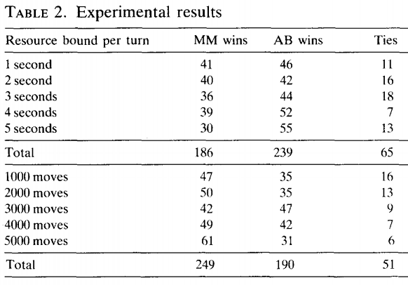

 # Synopsis 
This summary focuses on a brief overview of the research paper by Ronald L. Rivest, titled [Game Tree Searching by Min / Max Approximation](https://people.csail.mit.edu/rivest/pubs/Riv87c.pdf).  I will highlight the goals, methodology, and results.   

# Research Brief Summary 
The research paper introduces a new iterative method for approximating min and max for searching game trees.  
The author's motivation was to try and improve the field of game playing by computers.    The author's goal was to develop a new technique that "will always expand the node that is expected to have the largest effect on the value."   This new "min/max approximation" technique attempts to focus the computer's attention on the important lines of play.  The key idea is to approximate the "min" and "max" operators with generalized mean-value operators, which the author feels is a good approximation to the min/max operators.  In turn, this will lead the selection of the next leaf node to expand.  The experimental results from almost 1,000 connect four games suggest this new technique outperforms minimax search with alpha-beta pruning, for the same number of calls to the move routine.  However, this new technique has higher overhead and thus more work is needed before it can be competitive when CPU time per turn is the limiting resource.   

# Methodology Highlights 
One of the main reason for the author selecting the generalized mean values is because it is more suitable for sensitivity analysis than the min or max functions.
This sensitivity can identify “an interesting way that leaf in a game tree upon whose value the value at the root depends most strongly”. This is done by taking derivatives of the generalized mean value functions at each node and using the chain rule.  This leaf will be the one to expand next.   

The heuristic approached chosen for this new "min/max approximation" technique is called iterative heuristics, which grow the search tree one step at a time.
As each leaf is chosen its successors are added to the tree.  The values provided by static evaluator (gives an estimate of the backed-up value for nonterminal nodes) at the new leaves are used to provide new back-up values to the leaves ancestors.  With this iterative approach some branches will be searched to a much greater depth than other branches.  Iterative heuristic differs from iterative deepening where one successively computes the back-up values for depths d=1, 2,…. until one runs out of time.   

To decide which leaf to expand in an iterative method, a nonnegative “penalty” (or “weight”) is assigned to every edge in the game tree.
Edges representing bad moves are penalized more than edges representing good moves.   Thus, the min/max approximation heuristic is a special case of the penalty based search method, where the penalties are defined in terms of the derivatives of the approximating functions.  Where less interest is placed in the approximated values but rather on the derivatives with respect to each argument.    

# Results 
The game connect-four was chosen as the basis for experimenting because it is commercially available and well known, yet simple to describe and implement.
In connect-four a legal move consists of dropping a token into any column which contains at least one unoccupied cell.  Black moves first; after that the players alternate turns. The winner is the first player to create a line of four tokens of his color in a row. This line may be horizontal, vertical, or diagonal. It is possible to have a tied game. 
The same static evaluation function was used by all game-playing strategies, so that differences in playing ability would not be due to differences in the static evaluators.  By convention Black was max and read was min.

Each strategy was allocated a fixed amount of resource to use in computing a move.  A fixed bound per turn, where a strategy could not save on the computation 
for one turn and use it later.    The two different resource bounds used where: elapsed CPU time (measured in seconds) and calls to the basic move subroutine (measured in thousands of calls). 
For each experiment, 49 different starting positions were considered.  Each starting position was defined by specifying the first two moves of the game.  As table 2 shows alpha-beta (AB) was superior to min/max approximation (MM) based on time usage but the reverse was true on moved-based resource limits.  Overall, the author found the results very encouraging but that further empirical validation of these ideas is needed. 

  
